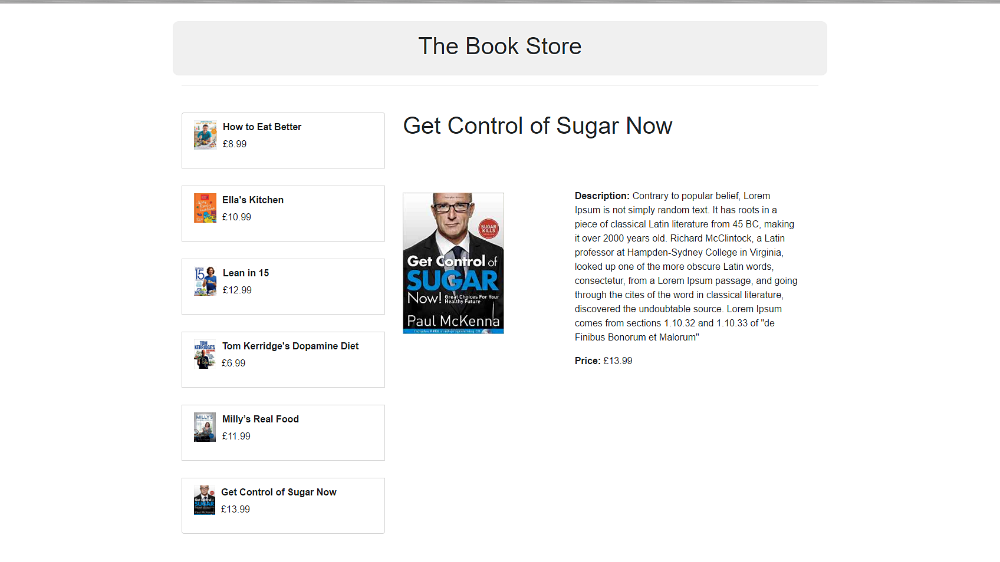

# React Redux simple example Amazon like Book Store

```

> git clone https://github.com/jwill9999/react_redux_book_store.git
> cd into folder react_redux_book_store
> npm install
> npm start
```

## Project view



A project showing a simple react redux application. We have a list of books and the ability to choose and display one to the customer. Each book is then displayed as a child element. This is example is focused on the use of react redux and doesnt use an external database. 

## Key Features

> React

> Redux

> Actions

> Reducers

> props

> mapStateToProps

> mapDispatchToProps

> connect 

> bindActionCreators


## Links 

[React Docs](https://facebook.github.io/react/docs/installation.html)

[Props](https://facebook.github.io/react/docs/components-and-props.html)

[Handing React Events](https://facebook.github.io/react/docs/handling-events.html)

[Redux Docs](http://redux.js.org/docs/introduction/)

[React Redux docs](http://redux.js.org/docs/basics/UsageWithReact.html)

[Action Creators](http://redux.js.org/docs/basics/Actions.html)

[Reducers](http://redux.js.org/docs/basics/Reducers.html)

[Redux Store](http://redux.js.org/docs/basics/Store.html)

[mapDispatchToProps Video eggheads.io](https://egghead.io/lessons/javascript-redux-using-mapdispatchtoprops-shorthand-notation)
